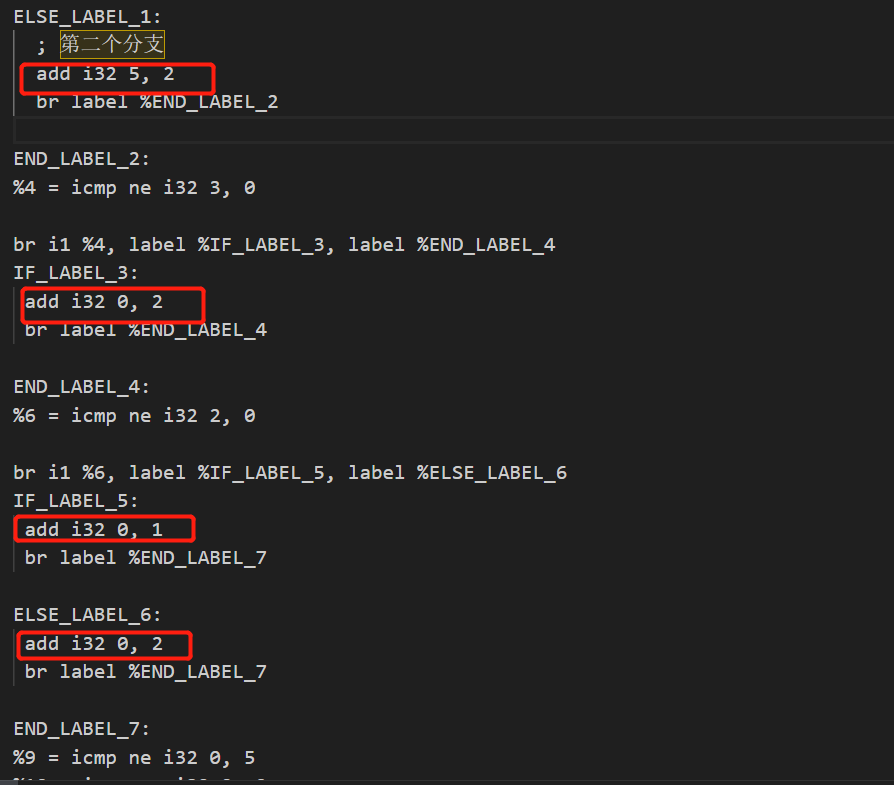
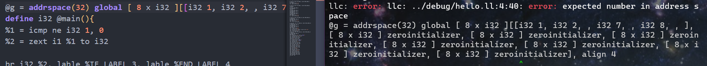
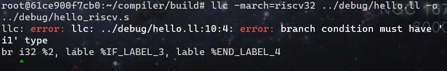
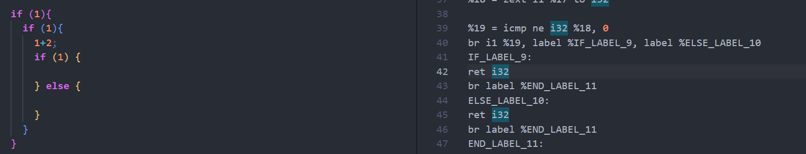
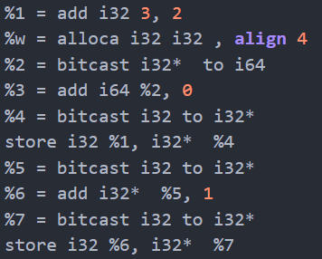
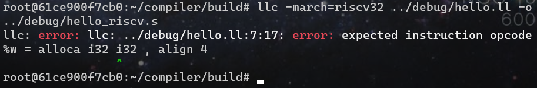

# 当前需要解决的格式问题

1. **[已解决] -> 目前直接使用不翻译一个单独exp语句的方法忽略这种语句即可**
   对于没有赋值的语句，`LLVM`会隐含给一个变量赋值，因此导致了变量编号不连续

   如下所示：

   

   解决：需要每个值表达式（即没有显式赋值的）直接显式赋值一个临时变量即可

2. **[已解决] -> 目前直接使用不翻译这个exp语句的方法忽略这种语句**
   对于单独的exp不应该翻译

   比如一个单独语句如下：

   ```c
   2;
   ```

   这是一个合法的`sysy`语句，但是不应该被翻译，在`IR`中不应该体现这种语句，必须是一个指令才可以

3. **[已解决] -> 目前使用的方法是直接在每个icmp指令后将结果0拓展到i32类型**
   运算类型问题

   `icmp`指令返回值的类型默认为`i1`，但是很多算数指令的类型是`i32`，这会导致类型不兼容的问题

4. **[已解决] -> 在IR树的dump中直接添加即可**
   全局变量之前需要添加`@`符号

5. 数组类型全局变量格式有误：如下所示：

   

   其中翻译的全局变量语句完整如下：

   ```assembly
   @g = addrspace(32) global [ 8 x i32 ][[i32 1, i32 2, , i32 7, , i32 8, , ], [ 8 x i32 ] zeroinitializer, [ 8 x i32 ] zeroinitializer, [ 8 x i32 ] zeroinitializer, [ 8 x i32 ] zeroinitializer, [ 8 x i32 ] zeroinitializer, [ 8 x i32 ] zeroinitializer, [ 8 x i32 ] zeroinitializer], align 4
   ```

   和正确版本对比之后发现貌似初始化也有误，应该是前四个被初始化，剩下的被看作0，但是这里的顺序貌似不对，7和8的位置不对，没有连续

   使用`clang`的`llvm`编译得到的正确版本对比如下：

   ```assembly
   @g = dso_local global [8 x i32] [i32 1, i32 2, i32 7, i32 8, i32 0, i32 0, i32 0, i32 0], align 16
   ```

6. **[已解决] -> 方法如下，直接在br前再添加一个icmp指令即可**
   `br`指令的条件语句类型必须是`i1`而不能是`i32`，因此对于上面3中的类型问题不能直接简单地使用0拓展解决

   

   这里由于之前的思路，已经在每隔`icmp`语句之后添加零拓展，将其直接转换成`i32`类型，这里为了能正常使用`br`，并且兼容之前的运算类型问题，可以在每个`br`语句之前加一条`icmp`再将响应的计算结果转化为`i1`类型，例子如下：

   这是原来的报错代码

   ```assembly
   %1 = icmp ne i32 1, 0
   %2 = zext i1 %1 to i32
   
   br i32 %2, label %IF_LABEL_3, label %END_LABEL_4
   ```

   下面我们只需要添加一条语句：（这个语句应该添加在br的前面）

   ```assembly
   %1 = icmp ne i32 1, 0
   %2 = zext i1 %1 to i32 ;这里的拓展是为了后面有可能需要继续用1的结果进行算数运算考虑
   
   %3 = icmp ne i32 %2, 0
   br i32 %3, label %IF_LABEL_3, label %END_LABEL_4
   ```

   即可

7. **[已解决] -> 修改ir_tree.cpp中dump()的实现即可**
   `br`语句下的`label`拼写错误

8. 空语句块貌似会被直接翻译成`ret`，这是错误的写法，如下
   

   这里`ret i32`不应该被翻译出来

9. 对于下述局部变量定义还是有问题

   ```c
   int w = 3+2;
   w = w+1;
   ```

   会被翻译成

   

   其中上面的`%w = alloca i32 i32, align 4`报错如下：

   

   具体语法参考https://llvm.org/docs/LangRef.html#memory-access-and-addressing-operations

   修改意见：`%w = alloca i32, align 4`即可，这里多了一个`i32`

10. 上面的局部变量还有其他问题，暂时还没有完全查清楚，包括load指令的使用缺失，`%5`那里没有变量等，以及需要考虑为什么这样的代码会引发`Segmentation Fault`

    ```c
    int w = 3+2;
      w = w+1;
      
      if (w) {
        // ...其他语句
      }
    ```

    

